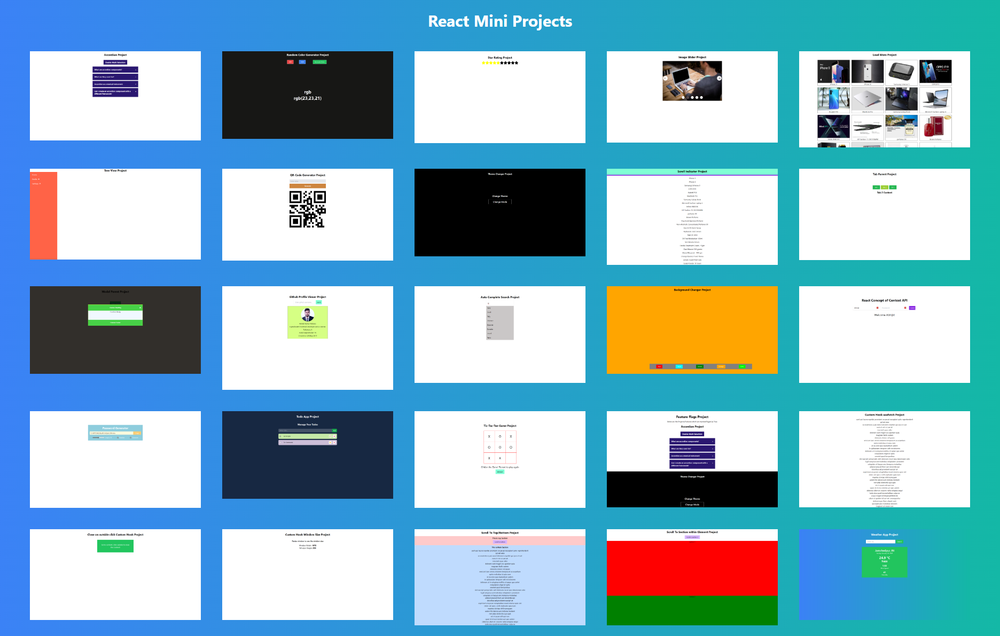

# React Mini Projects

Welcome to my React Mini Projects repository! This collection consists of various small React applications that I built while learning React. Each project is designed to showcase different aspects of React and its ecosystem.

## Visit [React Mini Projects](https://react-mini-projs.vercel.app/)

## Home Page

## Project List

1. **Accordian**: A simple accordion component to display collapsible content sections with multiple/single selection.

2. **Auto Complete Search**: An input field with auto-complete suggestions as you type.

3. **Background Changer**: Allows users to dynamically change the background color.

4. **Custom hook (useCloseOnOutsideClick)**: Demonstrates a custom React hook for handling click events outside a specified element.

5. **React Concept of Context API (UserContext)**: Illustrates the use of React Context API with a user context.

6. **Custom hook (useFetch)**: A custom hook for handling data fetching in React components.

7. **Custom hook (useWindowSize)**: Shows how to use a custom hook to track and respond to changes in window size.

8. **Theme Changer (Dark-Light Mode)**: Enables users to switch between dark and light themes.

9. **Feature Flags**: Implements feature flags to conditionally enable or disable certain features.

10. **Github Profile Viewer**: Fetches and displays GitHub user profiles using the GitHub API.

11. **Image Slider**: A simple image slider/carousel component.

12. **Load More**: Demonstrates a "Load More" button to fetch and display additional content.

13. **Modal**: A basic modal component for displaying overlay content.

14. **Password Generator**: Generates random passwords with customizable options.

15. **QR-Code Generator**: Allows users to generate QR codes for specified data.

16. **Random Color Generator**: Generates random colors and displays them.

17. **Scroll Indicator**: Displays a progress indicator as the user scrolls down a page.

18. **Scroll to Section within Element**: Scrolls to a specific section within an element.

19. **Scroll to Top and Bottom**: Provides buttons to quickly scroll to the top or bottom of the page.

20. **Star Rating**: Allows users to rate something using a star-based rating system.

21. **Tabs**: A simple tabs component for organizing content.

22. **TicTacToe Game**: Classic Tic Tac Toe game implementation.

23. **Todo App**: Basic to-do list application.

24. **Tree View Sidebar**: Implements a tree-view sidebar navigation component.
25. **Weather App**: Simple and intuitive weather app providing real-time weather information based on user location or search queries, built with Vite.js and utilizing OpenWeatherMap API.

## Usage

The projects in this repository are designed as individual components and are distributed in their respective directories. Each directory contains a self-contained React mini project as component.
